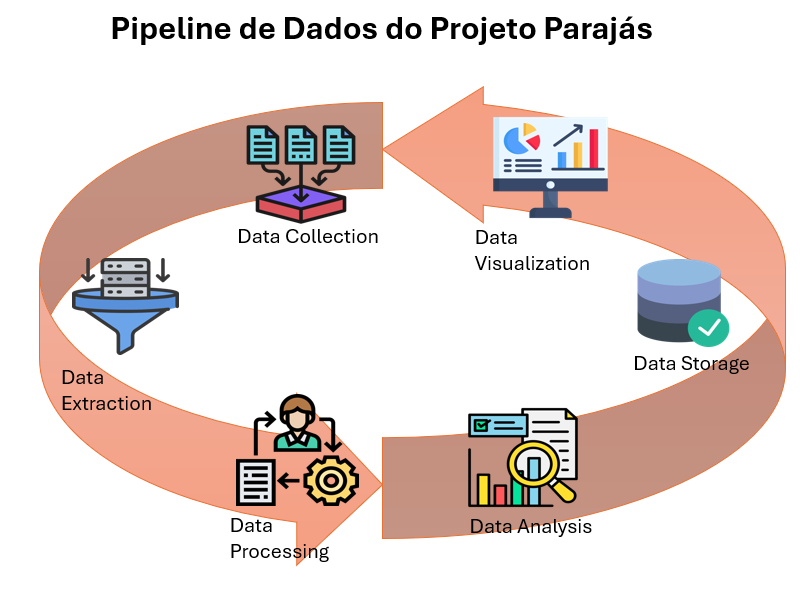

# PIPELINE DOS DADOS DO PROJETO PARAJÁS

Este ciclo envolve várias etapas, desde a aquisição até a análise e armazenamento dos dados. Aqui está uma visão geral das etapas típicas envolvida neste processo no **Projeto Parajás**:

1. Coleta de Dados (**Data Collection**)**: Esta etapa envolve a aquisição de dados brutos extraídos utilizando o protocolo OAI-PMH (oai_dc:) das revistas incluídas na base de dados do projeto.

2. Extração de Dados (**Data Extraction**): Nesta fase, os dados são extraídos de suas fontes originais (arquivo em formato xml) e convertidos para um formato adequado para processamento (arquivo em formato xlsx).

3. Tratamento de Dados (**Data Processing**): Inclui a limpeza, transformação e integração dos dados. Isso pode envolver a remoção de duplicatas, preenchimento de valores ausentes, transformação de dados para um formato comum, e integração de múltiplas fontes de dados em um único conjunto coeso.

4. Análise de Dados (**Data Analysis**): Esta etapa envolve a aplicação de técnicas estatísticas, algoritmos de aprendizado de máquina e outras metodologias para extrair insights dos dados. O resultado desta etapa é convertido em indicadores internos ao **Projeto Parajás** e a outros projetos de estudos métricos.

5. Armazenamento de Dados (**Data Storage**): Os dados processados e analisados são armazenados em sistemas de gerenciamento de banco de dados para disponibilidade, consulta e análise dos usuários da plataforma do **Projeto Parajá** através de sua interface na web.

6. Visualização de Dados (**Data Visualization**): A apresentação dos dados processados em formatos gráficos ou relatórios que facilitam a interpretação dos resultados por parte dos tomadores de decisão. O resultado desta etapa é convertido em indicadores internos ao **Projeto Parajás** e a outros projetos de estudos métricos.

Essas etapas são cíclicas e iterativas, já que os dados são continuamente coletados, processados e analisados para informar decisões e melhorar processos. Além do objetivo central do **Projeto Parajás** que é de ser uma base de dados regional de ciência aberta do domínio do Direito. 

